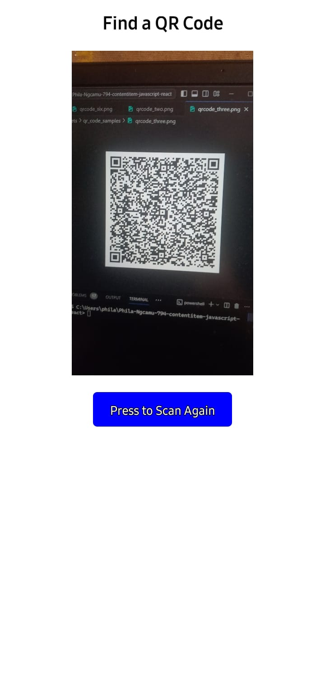
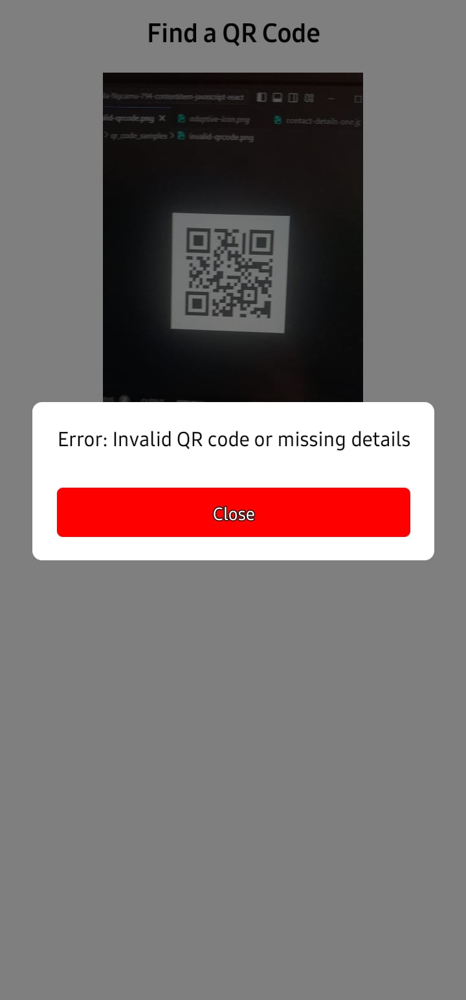

Project link to the repo: https://github.com/Umuzi-org/Phila-Ngcamu-794-contentitem-javascript-react/tree/proof-of-concept

Screenshots of possible contact details after scanning unique QR code:

- 👇🏽 Initial Screen

- 👇🏽 Profile Name: Mary Davis

- 👇🏽 Press to Scan Again

👇🏽 Error: Invalid QR Code

