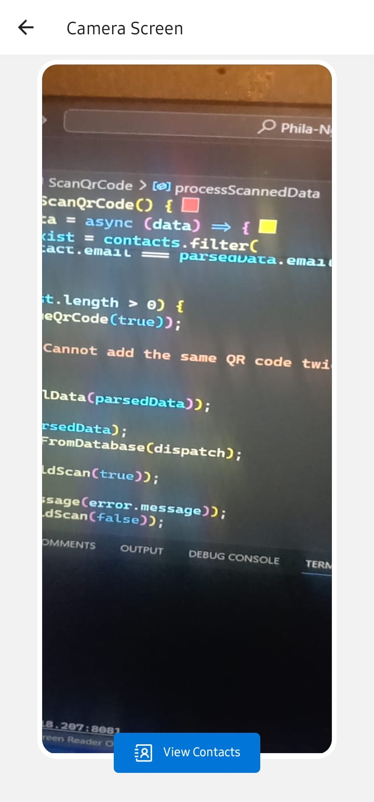
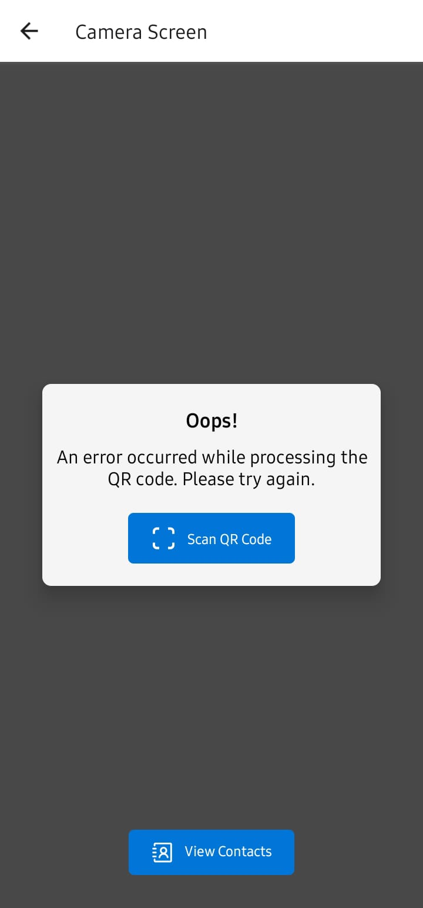

Project link to the repo: https://github.com/Umuzi-org/Phila-Ngcamu-794-contentitem-javascript-react/tree/main

QR Conference Connector - [Proof of Concept](http://syllabus.africacode.net/react-native/qr-conference-connector/proof-of-concept/)

QR Conference Connector - [Contact List](http://syllabus.africacode.net/react-native/qr-conference-connector/contact-list/)

# QR Conference Connector App Screenshots

  <table>
    <tr>
      <td>Contact List Screen</td>
      <td>Camera Screen</td>
      <td>Contact Details Screen</td>
      <td>Profile Name: Alex Johnson</td>
      <td>Error: Invalid QR Code</td>
    </tr>
    <tr>
      <td></td>
      <td></td>
      <td></td>
      <td></td>
      <td></td>
    </tr>
  </table>

